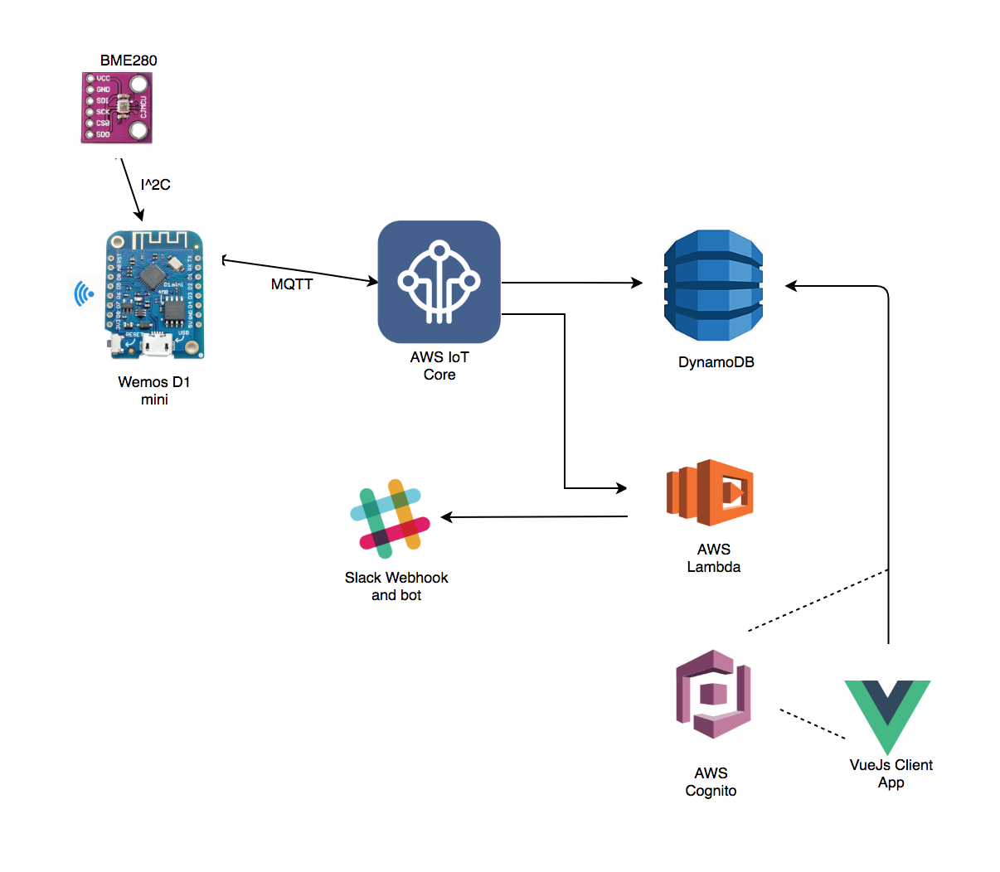
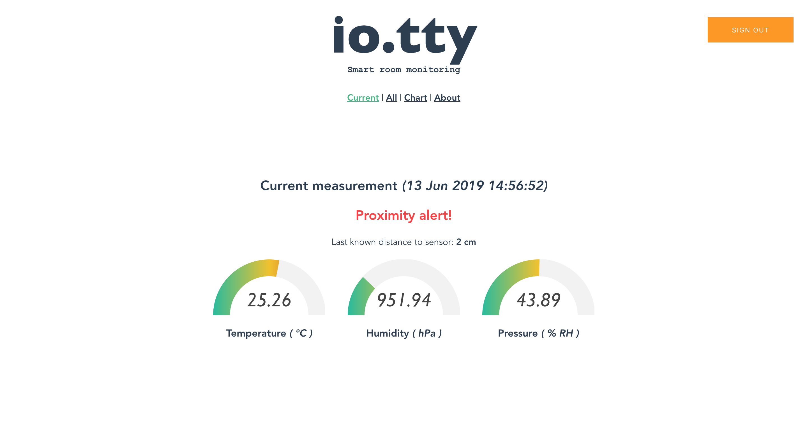

# io.tty

Simple weather monitor that sends data (temperature, humidity and pressure) periodically to AWS IoT Core via MQTT.

#### Simple wireframe: 

## The device

The main controller used is [Wemos D1 Mini](https://wiki.wemos.cc/products:d1:d1_mini) and [Adafruite BME280](https://www.adafruit.com/product/2652)

## Code 

#### Wemos D1 + sensors

- [This](https://github.com/debsahu/esp8266-arduino-aws-iot-ws) wrapper library was used to establish the connection between the device and [AWS IoT Core](https://aws.amazon.com/iot-core/). The readings from the sensor are delivered on the *I2C bus*.

The setup for this is easy - check [the board code](./src/thing/aws-iot-core-mqtt.ino). All the other libraries used are standard and widely used.

#### Configuration in AWS Console

- Next, the IoT core hook to **DynamoDB** and **AWS Lambda** was configured though the *AWS Console*.

#### Slack integration

- A slack bot was configured and the lambda (NodeJs) is calling the **Slack Webhook** every time a measurement is being sent: 
  * [Slack channel](https://iotty42.slack.com/messages/CFM6UPR7X/) with measurements bot

#### VueJs Client

- The **VueJs** client located [here](./src/io.tty-client) was created with **Vue CLI (v3)** and **aws-amplify + aws-amplify-vue** for easier configuration of **AWS Cognito**. The authenticated role of the user pool for this application was given read access on the **DynamoDB** table for it, meaning that only authenticated users from that particular user pool can get the data from that table.
 
